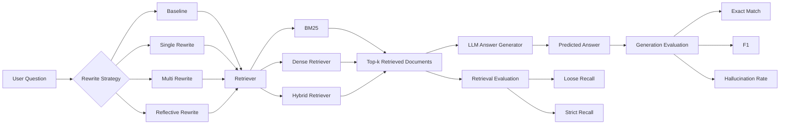

# Agentic Query Rewriting for Retrieval-Augmented Generation

Improving retrieval recall and answer accuracy in Retrieval-Augmented Generation (RAG) pipelines via LLM-based query rewriting.

---

# Abstract

Retrieval-Augmented Generation (RAG) systems rely heavily on the quality of the retrieval step. Poorly formulated queries can lead to missing evidence documents, which often results in hallucinated or incorrect answers from downstream language models.

This project investigates whether **LLM-based query rewriting strategies** can improve retrieval quality and downstream QA performance in RAG pipelines.

We evaluate four query strategies:

- Baseline (no rewriting)
- Single query rewrite
- Multi-query expansion
- Reflective rewriting

Experiments are conducted on two datasets:

- **HotpotQA** (multi-hop QA)
- **BEIR-FiQA** (financial retrieval benchmark)

and three retrievers:

- BM25
- Dense Retrieval (MiniLM embeddings)
- Hybrid Retrieval (BM25 + Dense)

Our results show that query rewriting provides **consistent improvements on multi-hop QA tasks**, while benefits are limited when strong dense retrievers already achieve high recall.

---

# Research Question

Does LLM-based query rewriting improve retrieval quality and downstream QA performance in RAG pipelines?

Specifically:

1. Can rewriting improve retrieval recall?
2. Does rewriting improve answer accuracy (EM / F1)?
3. How does rewriting interact with different retrievers?
4. Does rewriting reduce hallucination in generated answers?

---

# Method

We implement four query rewriting strategies.

## Baseline

The original user query is directly used for retrieval without modification.

## Single Rewrite

A language model rewrites the query once to produce a clearer retrieval-oriented formulation.

## Multi-Query Rewrite

Multiple alternative rewrites are generated and used jointly for retrieval to increase coverage of relevant documents.

## Reflective Rewrite

The model first analyzes potential issues in the query and then generates a refined query.

---

# Experimental Setup

## Datasets

### HotpotQA

Multi-hop question answering benchmark.

- Requires retrieving **multiple supporting documents**
- Evaluates both retrieval quality and reasoning ability

### BEIR-FiQA

Financial question answering dataset from the BEIR benchmark.

- Domain-specific financial queries
- Primarily tests factual retrieval

---

## Retrieval Models

Three retrieval systems are evaluated:

BM25

Sparse lexical retrieval.

Dense Retrieval

MiniLM embedding-based semantic retrieval.

Hybrid Retrieval

Fusion of BM25 and dense scores.

---

## Evaluation Metrics

Retrieval Metrics

- Loose Recall
- Strict Recall

Generation Metrics

- Exact Match (EM)
- F1 Score

Reliability

- Hallucination Rate

---

# Results

## Retrieval Recall

Dense retrieval achieves the highest recall across both datasets.

However, query rewriting provides consistent improvements for weaker retrievers and complex queries.

---

## BEIR-FiQA

Dense retrieval already performs strongly.

Retriever | Strategy | Loose Recall
--- | --- | ---
Dense | Baseline | 0.855
Dense | Single Rewrite | 0.845
Dense | Multi Rewrite | 0.840
Dense | Reflective Rewrite | 0.840

Because dense retrieval already captures semantic similarity well, rewriting produces minimal improvements.

For BM25:

Retriever | Strategy | Loose Recall
--- | --- | ---
BM25 | Baseline | 0.455
BM25 | Multi Rewrite | 0.510

Multi-query rewriting improves recall by ~12% relative gain.

---

## HotpotQA

HotpotQA requires retrieving multiple supporting documents.

Strategy | Loose Recall
--- | ---
Baseline | 0.778
Multi Rewrite | 0.792

For dense retrieval:

Strategy | Loose Recall
--- | ---
Baseline | 0.798
Multi Rewrite | 0.802

Reflective rewriting achieves the highest strict recall:

Strategy | Strict Recall
--- | ---
Reflective Rewrite | 0.260

---

# QA Performance

On HotpotQA, rewriting also improves answer quality.

Retriever | Strategy | EM | F1
--- | --- | --- | ---
BM25 | Reflective Rewrite | 0.266 | 0.335
Dense | Reflective Rewrite | 0.260 | 0.340

Compared to baseline:

EM improves from 0.236 → 0.260  
F1 improves from 0.316 → 0.340

This indicates that improved retrieval can translate into better answer generation.

---

# Hallucination Rate

Hallucination rates remain relatively stable.

Dataset | Retriever | Strategy | Hallucination
--- | --- | --- | ---
HotpotQA | BM25 | Baseline | 0.066
HotpotQA | BM25 | Reflective Rewrite | 0.054

Reflective rewriting slightly reduces hallucination in some settings.

---

# Hybrid Retrieval Behavior

Hybrid retrieval shows sensitivity to query rewriting.

Example on BEIR-FiQA:

Strategy | Loose Recall
--- | ---
Baseline | 0.805
Multi Rewrite | 0.305

Multi-query rewriting significantly degrades hybrid performance.

This suggests lexical expansion may conflict with sparse ranking signals.

---

# Discussion

## Rewriting Helps Multi-Hop Retrieval

HotpotQA questions often require retrieving multiple supporting passages.

Query rewriting increases the chance of retrieving relevant documents for complex queries.

---

## Strong Dense Retrievers Reduce Rewriting Gains

On BEIR-FiQA, dense retrieval already achieves high recall (0.855).

In such cases, rewriting has limited additional benefit.

---

## Hybrid Retrieval is Sensitive to Reformulation

Hybrid systems rely partly on lexical matching.

Aggressive rewriting may remove important lexical cues, degrading sparse retrieval scores.

---

## Key Takeaway

Query rewriting is most beneficial when:

- the retriever struggles with lexical mismatch
- queries require multi-hop reasoning
- sparse retrievers are used

---

# Experiment Pipeline

User Query
→ Query Rewriter (LLM)
→ Retriever (BM25 / Dense / Hybrid)
→ Retrieved Documents
→ LLM Answer Generation
→ Evaluation (Recall / EM / F1 / Hallucination)

---

## Pipeline Diagram

---

# RAG Pipeline

Question
→ Rewrite Strategy (Baseline / Single / Multi / Reflective)
→ Retriever
→ Top-k Documents
→ LLM Answer Generation
→ Evaluation Metrics

---

# Reproducing the Experiments

Install dependencies

pip install -r requirements.txt

---

Dataset Preparation

python src/prepare_hotpotqa.py  
python src/prepare_beir.py

---

Run Full Pipeline

python src/prepare_hotpotqa.py  
python src/build_corpus.py  
python src/prepare_beir.py  
python src/dense_index.py  
python src/bm25_index.py  
python src/runner.py  
python src/summarize_results.py  
python src/plot_results.py  

Outputs:

results/  → experiment metrics  
figures/  → generated plots  

---

# Project Structure

agentic-query-rewriting-rag

src  
prepare_hotpotqa.py  
build_corpus.py  
prepare_beir.py  
dense_index.py  
bm25_index.py  
runner.py  
summarize_results.py  
plot_results.py  

results  

figures  

README.md  
requirements.txt  

---

# Contributions

This project provides:

- A reproducible experimental framework for studying query rewriting in RAG systems
- Empirical comparison across multiple datasets and retrievers
- Analysis of interactions between query rewriting and hybrid retrieval
- A modular pipeline for testing future RAG improvements

# Case Study

To better understand when query rewriting helps and when it fails, we analyze two representative examples from BEIR-FiQA and HotpotQA.

## Case 1: FiQA retrieval succeeds loosely, but answer generation still hallucinates

**Question**

> How to deposit a cheque issued to an associate in my business into my business account?

### Observation

Across multiple retrievers and rewriting strategies, the system consistently achieved:

- **Loose Recall = 1**
- **Strict Recall = 0**
- **EM = 0**
- **F1 = 0**
- **Hallucination = 1**

For example, under **BM25 + Baseline**, retrieved document IDs included:

`65404, 422886, 367754, 590102, 64556`

Under **BM25 + Multi Rewrite**, the retrieved IDs slightly changed in ranking:

`65404, 590102, 422886, 367754, 64556`

Despite this retrieval variation, the generated answer remained essentially the same:

> Have the associate sign the back of the cheque and then deposit it into your business account. Alternatively, the associate can endorse it in front of the teller with some ID.

### Analysis

This example shows that **retrieval overlap alone is not sufficient for faithful answer generation**.  
Although the system retrieved partially relevant evidence, it failed to retrieve a document set that fully supported the final answer under the strict metric.

As a result, the generator produced a plausible banking procedure, but one that was not fully grounded in the retrieved evidence. This leads to:

- high loose recall
- zero strict recall
- zero EM/F1
- full hallucination

### Takeaway

For FiQA-style factual questions, query rewriting may slightly reorder or expand retrieved evidence, but this does not necessarily improve factual grounding if the critical supporting document is still missing.

---

## Case 2: HotpotQA fails because only the first hop is retrieved

**Question**

> In what year was the university where Sergei Aleksandrovich Tokarev was a professor founded?

**Gold Answer**

> 1755

### Observation

Across BM25, dense, and hybrid retrieval, as well as across all rewriting strategies, the system consistently retrieved the entity page:

`Sergei Aleksandrovich Tokarev`

However, it failed to retrieve the second-hop evidence needed to answer the question, and the predicted answer was always:

> insufficient information

Typical retrieved titles under **BM25 + Baseline**:

- Sergei Aleksandrovich Tokarev
- Sergei Aleksandrovich Kudryavtsev
- Sergei Sholokhov
- Jeffrey MacKie-Mason
- Achille Mbembe

Typical retrieved titles under **Dense + Baseline**:

- Sergei Aleksandrovich Tokarev
- Sergei Kosarev
- Sergei Dmitrochenko
- Boris Berezovsky (businessman)
- Sergei Sholokhov

Metrics remained:

- **Loose Recall = 1**
- **Strict Recall = 0**
- **EM = 0**
- **F1 = 0**
- **Hallucination = 0**

### Analysis

This is a classic **multi-hop retrieval failure**.

The system successfully retrieved the first-hop entity page about Tokarev, but failed to retrieve the second supporting document about the university where he taught and that university's founding year.

This explains why:

- loose recall is high
- strict recall remains zero
- answer generation fails safely with "insufficient information" instead of hallucinating

### Takeaway

For multi-hop QA, query rewriting alone is often insufficient if the retriever cannot explicitly bridge the intermediate reasoning step. This suggests that **multi-hop decomposition or iterative retrieval** may be more effective than simple rewrite-based reformulation.
